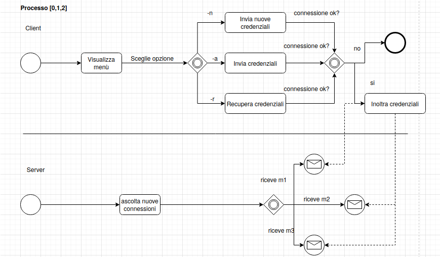

# Remote Backup

Descrizione progetto qui...

## Environment

L'environment scelto per lo sviluppo dell'applicativo si basa su [Docker](https://www.docker.com/why-docker) [container](https://www.docker.com/resources/what-container). La scelta ricade su questo tipo di tecnologia per i seguenti motivi:

- **virtualizzazione:** tramite virtualizzazione si abbattono le differenze provenienti dai vari sistemi, di conseguenza ogni sviluppatore può interagire con lo stesso identico environment che utilizzeranno anche gli altri. Questo permette di evitare conflitti dovuti a diverse versioni di librerie e permette di evitare il classico problema del *"Funziona sul mio pc"*.

- **filesystem:** la tecnologia dei container si basa sul concetto di [image](https://docs.docker.com/get-started/overview/). Vista da un punto di vista molto astratto un immagine docker non è nient'altro che un filesystem, questo oltre a risolvere il problema di avere diverse versioni di librerie si presta molto al contesto di questa applicazione. Utilizzando diversi container infatti si può testare in maniera semplice la sincronizzazione di una cartella tra versione locale e remota. Ogni container infatti ha il suo filesystem che è isolato da quello degli altri.

- **network:** la tecnologia docker permette di creare in maniera molto comoda delle reti sulle quali i container possono comunicare. In questo modo si possono simulare dei contesti di rete che sono fedeli a quelli nei quali si viene a trovare l'applicativo da distribuire.

- **docker-compose:** [docker compose](https://docs.docker.com/compose/) è un tool che permette in maniera molto semplice di coordinare diversi container, in questo modo è possibile simulare diversi client che agiscono sul sistema, ma anche creare delle repliche del server nell'ottica di rendere più scalabile l'applicazione.

Lo schema applicativo si presenta nel seguente modo.

Il supporto C++ alle varie componenti dell'applicazione viene fornito da [boost](https://www.boost.org/), di conseguenza dove possibile viene preferita un'implementazione già fornita all'interno di questa collezione di librerie piuttosto che una custom. Le comunicazioni tra client e server avvengono tramite TCP/IP e le comunicazioni a livello applicativo avvengono tramite HTTP con preferenza JSON per la rappresentazione dei messaggi. La scelta ricade su queste tecnologie in quanto ormai sono di fatto uno standard ed ampiamente utilizzate in diversi applicativi, oltre assere semplici, versatili e portabili. Il server a tale scopo espone un API con tutti i metodo necessari, descritti nel seguente paragrafo, ad erogare il servizio di sincronizzazione. Un ultimo modulo che troviamo è un DB che serve per memorizzare informazioni relative agli utenti, allo stato dei file ecc. (si rimanda per i dettagli alla sezione sul DB).

## Architettura Frontend

L'applicativo lato client presenta due processi, uno serve a presentare l'interfaccia (un menù da console), il secondo invece svolge le operazioni di monitoring e serve a comunicare con il server. I due processi comunicano tramite pipe, il menù invia i comandi da effettuare e riceve eventualmente indietro dei messaggi dal processo che comunica con il server. La scelta di sdoppiare i processi risiede sia nel fatto che in questo modo l'applicazione è più manutenibile (si potrebbe passare da un'interfaccia da linea di comando ad una grafica in futuro), sia perché in questo modo è gestibile in maniera più ordinata sia la chiusura del programma che un eventuale messa in background del processo che lavora con il server.

## Architettura Backend

L'architettura lato backend presenta un processo che serve a ricevere richieste da parte dall'utente e n processi che fungono da controller. Il numero di controller è dato dal numero di subpath di primo livello presenti nelle url dell'API esposta al client. Se le URL esposte sono per esempio: - `\foo \bar \foo\paz` al momento di startup l'applicazione creerà tre processi, un processo padre e due controller figli per rispondere alle richieste ricevute rispettivamente per - `\foo` e per `\bar`. Anche questo tipo di scelta deriva da una struttura abbastanza consolidata e che riguarda gli applicativi backend che ormai, a prescindire dal linguaggio utilizzato, sfruttano la suddivizione delle richieste tramite dei controller. Questo permette ovviamente di aumentare la modularità e di rendere l'applicativo più scalabile.

> **Approfondimento:** valutare uso di load balancer, in questo caso il server esposto al client servirebbe solo da bilanciatore di carico, questo inoltrerebbe le richieste ai veri server che avrebbero la stessa struttura indicata prima, con la differenza che ora dovrebbero comunicare in qualche modo il loro stato di carico.

## Architettura DB

Descrivere DB (scelta tra MySql e MongoDB) engine scelta qui e motivare scelta.

**tabella username:** In questa tabella troviamo un id interno che rappresenta un utente, un username scelto dall'utente stesso, la password memorizzata in chiaro e il campo più importante che è l'hashed_status, questo rappresenta lo stato della cartella di riferimento dell'utente. Tramite questo campo si riesce a capire se sono stati effettuati cambiamenti all'interno della cartella. Questo campo viene calcolato a partire da checksum di riferimento dei vari file e directory presenti all'interno della directory dell'utente.

| id | username | password | hashed_status |
|:--:|:--------:|:--------:|:-------------:|
| 0 | myuser | abc123 | ahjsdkfjh343! |

## Descrizione processi

Le varie azioni possibili sono riassunte di seguito in tabella. Ad ogni azione viene assegnato un codice che rimanda al sottoparagrafo dove vengono spiegati i vari dettagli.

| codice | nome | comando | parametri | risposta |
| :----: | :--: | :-----: | :-------: | :------: |
|   0    | signup | POST /signup | `{user:"username", pass1:"password", pass2:"password"}` | caso positivo: `{token:"server_token_here"}`, caso negativo: `{msg:"errore qui"}` |
| 1 | signin | POST /signin | `{user:"username", pass:"password"}` | come sopra |
| 2 | recover | POST /recover | `{user:"username"}`| in caso positivo `{pass:"password"}`, in caso negativo: `{msg:"errore qui"}`|
| 3 | reset | DELETE /reset | `{token:"token_string"}` | 200 in caso positivo, 400 se non autorizzato |
| 4 | file | POST /file | `{token:"token_string", filepath:"filepath", nparts:2, part: 1, data:"sdfsd"}` | come sopra |
| 5 | file | PUT /file | `{token:"token_string", filepath:"filepath", part: 1, offset: 15, data:"sdfsd"}` | come sopra |
| 6 | file | DELETE /file | `{token: "token_string", filepath: "filepath"}` | come sopra |
| 7 | status | GET status | `{token:"token_string"}` | `{status:"hashed_status"}`
| 8 | status | GET status/all | `{token:"token_string"}` | `[{filepath:"filepath1", status:"checksum1"}, {filepath:"filepath2", status:"checksum2"}]`

### Processi [0,1,2] 

Il processo di (registrazione/autenticazione/recover) avviene al momento del startup dell'applicazione, un client infatti deve essere autenticato per poter interagire con il server. All'avvio se un client non possiede un token valido da presentare al server, viene mostrato un menù che offre le possibilità di autenticarsi, registrarsi o recuperare una password. L'utente indica uno tra i seguenti comandi: 

- `-n`: permette di creare un nuovo account
- `-a`: permette di accedere con credenziali
- `-r`: permette di recuperare una password dimenticata.
- `-s`: permette di selezionare la cartella da sincronizzare
- `-q`: permette di chiudere in maniera ordinata l'applicativo
- `-b`: chiude la finestra del menù e lascia lavorare il secondo processo in background.

Presente

una volta scelto il comando la console guiderà l'utente sui parametri da inserire, questi verranno inviati al server. In caso di esito positivo viene restituito un token di accesso per i primi due comandi e la password per il terzo, in caso negativo viene stampato il messaggio d'errore e viene permesso all'utente di selezionare nuovamente un'opzione dal menù. Il token ricevuto verrà memorizzato in un apposito file ed in una variabile e verrà utilizzato per le seguenti operazioni sul server. Se manca connessione ad internet, se il server non è raggiungibile o se non si effettua l'accesso l'applicativo continua a funzionare in locale. Questo implica che il client continua a memorizzare le informazioni necessarie per effettuare una sync nel momento in cui si riesca nuovamente a collegarsi al server.

Una volta lanciato il programma un utente potrà selezionare la cartella da sincronizzare, se non precedentemente fatto, ed in ogni momento può arrestare il processo con un apposito comando. Per semplicità quindi il client presenterà due processi, uno che serve a gestire l'interfaccia, il secondo invece serve ad interagire con il server.

> **NB**: il processo di autenticazione è volutamente insicuro e poco flessibile, questo perché se l'autenticazione è necessaria non è punto cardine di questo progetto che non deve rappresentare un prodotto finale. Ad ogni modo si tenterà di garantire un approccio modulare che permetterà in futuro di sostituire questo modulo con uno più robusto.

### Processo 3 (reset)

Questo comando viene triggerato dall'opzione `-s <new directory to watch>` dal menù quando è presente già una cartella monitorata. Quando questa opzione sussiste prima di lanciare il comando è opportuno avvisare il client in quanto il contenuto sul server verrà eliminato per risparmiare spazio.

> **NB** esiste un reset, ma non un bulk create, quando si seleziona una directory da sincronizzare sostanzialmente vengono lanciati a cascata messaggi di add file.

### Processo 4 (add a file)

Ogni qual volta che si aggiungue un nuovo file non viene creato semplicemente il file, ma tutto il percorso che porta al file, questo per evitare di dover separare la creazione dei file dalla creazione delle directory. Il file viene ricevuto in chunk di dimensione MAX fissa contenuti in un file JSON. Il fatto di dividere in chunk il file ci da diversi vantaggi, non si deve scrivere il file sul server in maniera totalmente sincrona, ci permette di mantenere la stessa struttura per i messaggi utilizzata per gli altri comandi e ci permette di non sforare la dimensione massima di un singolo file JSON. Il campo `nparts` ci fornisce l'informazione sul numero di chunk in quali è stata divisa la trasmissione, il campo `part` ci dice invece quale parte del file stiamo ricevendo. Una volta completata la scrittura si calcola una checksum che viene memorizzata nel database (campo `hashed_status`).

### Processo 5 (update a file)

Questo processo è analogo al precedente, in questo caso però si specifica anche l'`offset` dal quale inizia la modifica e i il campo `data` rappresenta solo la porzione modificata del file. Una volta completata la modifica si ricalcola la chesum del file e viene aggiornato il db (campo `hashed_status`).

### Processo 6 (delete file)

Questo processo permette di eliminare un file dalla directory. Una volta eliminato il file si elimina la rispettiva entry dalla tabella delle checksum e si ricalcola la checksum della directory dell'utente (campo `hashed_status`).

### Processo 7 (get status)

Permette di ottenere la checksum sull'intera directory utente, in questo modo è possibile sapere se sono state effettuate modifiche alla cartella ed in caso affermativo eseguire il seguente comando.

### Processo 8 (status/all)

Permette di recuperare tutte le checksum dei file memorizzati sul server, in questo modo è possibile capire quale file è outdated ed eseguire un aggiornamento.

idee: 

- challenge-response auth simmetrico (segreto memorizzato in locale da utente) viene richiesto ad avvio prima volta
- utenti già memorizzati
- limite dim_max cartella
