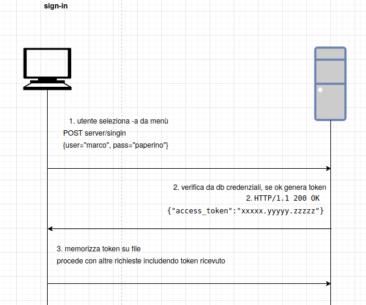

# Remote Backup

Descrizione progetto qui......

## Environment

L'environment scelto per lo sviluppo dell'applicativo si basa su [Docker](https://www.docker.com/why-docker) [container](https://www.docker.com/resources/what-container). La scelta ricade su questo tipo di tecnologia per i seguenti motivi:

- **virtualizzazione:** tramite virtualizzazione si abbattono le differenze provenienti dai vari sistemi, di conseguenza ogni sviluppatore può interagire con lo stesso identico environment che utilizzeranno anche gli altri. Questo permette di evitare conflitti dovuti a diverse versioni di librerie e permette di evitare il classico problema del *"Funziona sul mio pc"*.

- **filesystem:** la tecnologia dei container si basa sul concetto di [image](https://docs.docker.com/get-started/overview/). Vista da un punto di vista molto astratto un immagine docker non è nient'altro che un filesystem, questo oltre a risolvere il problema di avere diverse versioni di librerie si presta molto al contesto di questa applicazione. Utilizzando diversi container infatti si può testare in maniera semplice la sincronizzazione di una cartella tra versione locale e remota. Ogni container infatti ha il suo filesystem che è isolato da quello degli altri.

- **network:** la tecnologia docker permette di creare in maniera molto comoda delle reti sulle quali i container possono comunicare. In questo modo si possono simulare dei contesti di rete che sono fedeli a quelli nei quali si viene a trovare l'applicativo da distribuire.

- **docker-compose:** [docker compose](https://docs.docker.com/compose/) è un tool che permette in maniera molto semplice di coordinare diversi container, in questo modo è possibile simulare diversi client che agiscono sul sistema, ma anche creare delle repliche del server nell'ottica di rendere più scalabile l'applicazione.

### Utilizzare applicazione con Docker

Una volta posizionati nella cartella relativa al progetto, eseguire `docker-compose up --build`. La terminazione può essere fatta tranquillamente in maniera ordinata con il comando `CTRL+C`.

## Architettura applicazione

L'archetettura ad alto livello delle componenti che compongono l'applicazione è la seguente.


Il supporto C++ alle varie componenti dell'applicazione viene fornito dalle librerie standard e da [boost](https://www.boost.org/), di conseguenza dove possibile viene preferita un'implementazione già fornita all'interno di questa collezione di librerie piuttosto che una custom. Le comunicazioni tra client e server avvengono tramite TCP/IP e le comunicazioni a livello applicativo avvengono tramite HTTP con preferenza JSON per la rappresentazione dei messaggi. La scelta ricade su queste tecnologie in quanto ormai sono di fatto uno standard ed ampiamente utilizzate in diversi contesti applicativi, oltre assere semplici, versatili e portabili. Il server a tale scopo espone un API con tutti i metodi necessari, descritti nel seguente paragrafo, ad erogare il servizio di sincronizzazione. Un ultimo modulo che troviamo è un DB che serve per memorizzare informazioni relative agli utenti, allo stato dei file ecc. (si rimanda per i dettagli alla sezione sul DB).

### Architettura Frontend

L'applicativo lato client presenta due processi, uno serve a presentare l'interfaccia (desktop app /tray app), il secondo invece svolge le operazioni di monitoring e serve a comunicare con il server. I due processi comunicano tramite IPC. La scelta di sdoppiare i processi risiede sia nel fatto che in questo modo l'applicazione è più manutenibile, sia perché in questo modo è gestibile in maniera più ordinata sia la chiusura del programma che un eventuale messa in background del processo che lavora con il server. Con questa architettura quindi la logica applicativa è demandata al processo che interagisce con il server, l'interfaccia invece serve solo ed esclusivamente per rendere l'interazione più user-friendly.

> **Link utili per gestione IPC e tray app:** [menubar](https://github.com/maxogden/menubar), [electron tray](https://www.electronjs.org/docs/api/tray), [ipc main](https://www.electronjs.org/docs/api/ipc-main), [ipc render](https://www.electronjs.org/docs/api/ipc-renderer).

### Architettura Backend

L'architettura lato backend presenta un processo che serve a ricevere richieste da parte dall'utente e n processi che fungono da controller. Il numero di controller è dato dal numero di subpath di primo livello presenti nelle url dell'API esposta al client. Se le URL esposte sono per esempio: - `\foo \bar \foo\paz` al momento di startup l'applicazione creerà tre processi, un processo padre e due controller figli per rispondere alle richieste ricevute rispettivamente per - `\foo` e per `\bar`. Anche questo tipo di scelta deriva da una struttura abbastanza consolidata e che riguarda gli applicativi backend che ormai, a prescindire dal linguaggio utilizzato, sfruttano la suddivizione delle richieste tramite dei controller. Questo permette ovviamente di aumentare la modularità e di rendere l'applicativo più scalabile. L'informazione su quanti e quali processi creare viene letta in fase di startup da un apposito file di configurazione `server-conf.json`.

> **Approfondimento:** valutare uso di load balancer, in questo caso il server esposto al client servirebbe solo da bilanciatore di carico, questo inoltrerebbe le richieste ai veri server che avrebbero la stessa struttura indicata prima, con la differenza che ora dovrebbero comunicare in qualche modo il loro stato di carico.

### Architettura DB

La scelta di utilizzare un DB come meccanismo di storage ha le seguenti motivazioni:

- **backup:**
- **allegerimento carico server:**
- **resilienza(ACID):**
- **performance:**(spazio su disco, sistema distribuito, integrità)

Le tabelle all'interno del DBMS sono le seguenti:

**username:** In questa collection troviamo un id interno che rappresenta un utente, un username scelto dall'utente stesso, la password memorizzata memorizzata tramite hash, il sale e il campo più importante che è l'hashed_status, questo rappresenta lo stato della cartella di riferimento dell'utente. Tramite questo campo si riesce a capire se sono stati effettuati cambiamenti all'interno della cartella. Questo campo viene calcolato a partire da checksum di riferimento dei vari file e directory presenti all'interno della directory dell'utente.

| id | username | password | salt | hashed_status |
| :---: | :---: | :---: | :---: | :---: |
| 0 | myuser | pass_hash_value | 3 | 123456898fgasd |


## Descrizione processi

Le varie azioni possibili sono riassunte di seguito in tabella. Ad ogni azione viene assegnato un codice che rimanda al sottoparagrafo dove vengono spiegati i vari dettagli.

| id | comando | descrizione | parametri | risposta |
| :--: | :--: | :--: | :--: | :--: |
| 0 | POST /signup | endpoint che permette di registrare un nuovo utente. | `{"user":"username", "pass1":"password","pass2":"password"}` | in caso positivo HTTP 1.1 200 `{"access_token":"xxxxx.yyyyy.zzzzz"}`, in caso negativo HTTP 1.1 400 `{"err_msg":"message here"}` |
| 1 | POST /signin | endpoint che permette di autenticare un utente precedentemente registrato | `{"user":"username", "pass1":"password"}` | come sopra |
| 2 | POST /file/{chunk_id}/{chunk_size}/{file_pathBASE64}/{timestamp_locale} | endpoint che permette di aggiungere un file appena creato, `{chunk_id}` corrisponde al numero di chunk che stiamo inviando, 0 per il primo chunk. Il parametro `{chunk_size}` corrisponde alla dimensione del chunk che stiamo inviando, questo corrisponde a `full` se si invia un chunk di dimensione massima (0.5MB), altrimenti la dimensione in byte. | HTTP headers: MIME: application/octect-stream body: 'binary data here'

### Autenticazione

L'autenticazione all'interno dell'applicazione si basa su [JWT](https://jwt.io/introduction/). Le informazioni relative all'autenticazione vengono memorizzate sia lato client che lato server. Lato client viene memorizzato il token in un apposito file **invisibile** `client-conf.json` che si presenta nel seguente modo:

```json
{   
    ...,
    "access_token":"xxxxx.yyyyy.zzzzz",
    ...
}
```
Lato server nel file di configurazione `server-conf.json`:

```json
{
    ...,
    "token-conf":
    {
    "kd_alg":"hmac-sha256",
    "expiration":172800000,
    "secret":"key_here"
    },
    ...
}

```

 L'autenticazione avviene solamente in due casi, al momento della registrazione e quando un token scade e va rinnovato. Per registrarsi un utente seleziona il  inserisce le informazioni necessarie ed invia il comando `/signup` al server.


Una volta ottenuto un token dal server il client ha la possibilità di sfruttare i comandi offerti dal server. Una generica richiesta del client quindi viene autenticata nel seguente modo.


Se il client ha già effettuato la registrazione, ma possiede un token scaduto allora esso dovrà selezionare la voce `-a` dal menù per autenticarsi. Da console inserirà quindi username e password ed invierà una richiesta `/signin` al server. Questo dovrà verificare le credenziali ricevute interrogando un database e se l'autenticazione va a buon fine esso invierà un token all'utente.



Per verificare le credenziali del client il server recupera l'hash ed il sale con cui è stato calcolato dal db, a questo punto procede a calcolare l'hash tramite algoritmo sha-256 e il sale recuperato, se le due stringhe coincidono allora l'utente è da considerarsi autenticato ed il server procederà con la generazione di un token.

### Startup

All'avvio dell'applicativo client se l'utente non è già registrato allora si procede con la registrazione. Se invece l'utente ha già un account le possibilità sono due: l'utente possiede un token valido oppure l'utente possiede un token scaduto. Nel secondo caso l'utente procede con il login tramite menù perché deve reinserire le credenziali per ricevere un nuovo token. Una volta ottenuto un token valido, tramite registrazione oppure tramite login, il client inizia la sua fase di sincronizzazione (dopo avere selezionato la cartella da sincronizzare nel caso di registrazione). Il client verifica la giusta corrispondenza tra struttura della cartella da sincronizzare e il file `client-struct.json` in qunato potrebbero esserci state delle modifica ad applicazione spenta. Una volta aggiornato il file `client-struct.json` se il file è stato modificato si procede con il ricalcolare l'hash complessivo del file. A questo punto il client chiede l'hash di status (campo hashed_status nel DB) al server tramite il comando `GET /status`. Se l'hash ricevuto dal server non corrisponde con quello locale il client chiede le informazioni relative alla struttura remota al server che verrà presentata nel seguente modo (il client mantiene una struttura analoga in un apposito file):

```json
    [
        {"path":"file1_path_here", "hash":"file1_hash_here", "last_mod":"timestamp_milliseconds", "chunks":["hash_a","hash_b"], "dim_last_chunk":1024},
        {"path":"file2_path_here", "hash":"file2_hash_here", "last_mod":"timestamp_milliseconds"}
    ]

```

A questo punto si procede con il confronto tra i timestamp prediligendo il timestamp più recente, se il server possiede la copia più aggiornata del file, allora il client richiede tramite il comando `GET /file/{chunk_id}/{chunksize}/{file_pathBASE64}` il file aggiornato, se è invece il client a possedere la versione aggiornata allora si procede con il comando `PUT /file/{chunk_id}/{chunksize}/{file_pathBASE64}`. La scelta di lavorare per chunk risiede nel voler minimizzare il traffico e alleggerire il server. Qualora infatti dei 100 chunk di un file, solo il quinto e il ventesimo risultano avere un hash differente, il client provvederà a inviare SOLO questi ultimi, evitando di dover inviare l'intero file.

### Eventi da monitorare (ad applicazione accesa)

Gli eventi da monitorare sono:

- Creazione di un file
- Aggiornamento file
- Eliminazione file esistente
- Rinominazione file
- Error su FileWatcher

- [link fileWatcher C++](https://solarianprogrammer.com/2019/01/13/cpp-17-filesystem-write-file-watcher-monitor/)
- [link fileWatcher Windows](https://docs.microsoft.com/en-us/dotnet/api/system.io.filesystemwatcher?view=netcore-3.1)

#### Creazione file

La creazione di un file genera le seguenti azioni.

1. aggiornare il file `client-struct.json` aggiungendo un entry per il file creato

2. ricalcolare hash totale cartella.

3. lanciare una serie di comandi `POST file/{chunk_id}/{chunk_size}/{file_pathBASE64}` con body contenuto del file. Nella richiesta viene specificato anche il path del file, in questo modo se il path sul server non esiste viene creato. Questo permette di evitare di gestire espliciti comandi per la creazione di directory.

Nel caso il file venga creato offline, oppure si perde la connessione durante il trasferimento, allora la procedura avviene a tempo di startup (forzata quando il client riesce a riconnetersi); se invece il file viene creato ad applicazione attiva allora la procedura viene triggerata da un directory watcher, nello specifico l'evento è `FileStatus::created`. 

#### Aggiornamento file

L'aggiornamento di un file è simile alla creazione. Anche in questo caso vanno eseguiti i punti da 1 a 3 con le seguenti modifiche:

1. aggiornare il file `client-struct.json` 

2. ricalcolare hash totale cartella.

3. lanciare una serie di comandi `PUT file/{chunk_id}/{chunk_size}/{file_pathBASE64}` con body i dati che riguardano i chunk modificati.

Nel caso il file venga modificato offline, oppure si perde la connessione durante il trasferimento, allora la procedura avviene a tempo di startup; se invece il file viene modificato ad applicazione attiva allora la procedura viene triggerata da un directory watcher, nello specifico l'evento è `FileStatus::changed`. I punti 2 e 3 in questo caso vengono eseguiti soltanto se `last_mod` è più recente rispetto a il valore presente in `client-struct.json` questo perché un utente potrebbe chiudere senza modificare il file.

#### Delete a file

L'eliminazione consiste nei seguenti passaggi

1. aggiornare il file `client-struct.json` 

2. ricalcolare hash totale cartella.

3. lanciare il comando `DELETE file/`.

Nel caso il file venga eliminato offline allora la procedura avviene a tempo di startup; se invece il file viene eliminato ad applicazione attiva allora la procedura viene triggerata da un directory watcher, nello specifico l'evento è `FileStatus::deleted`.
