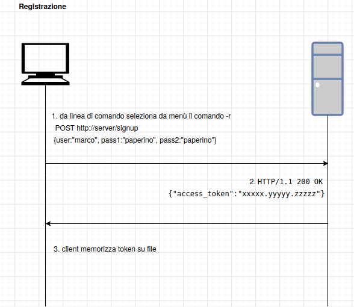
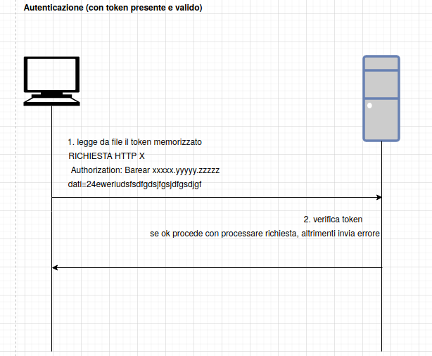

<h1 align="center">
  <a href="https://github.com/GJGits/remote_backup" title="Pedibus Documentation">
    
  </a>
  <br/>
</h1>

<p align="center">
  Sitema di backup remoto
</p>

<p align="center">
 
 
</p>

# Introduzione

L'applicazione ha il compito di fornire un sistema di incremental backup del contenuto di una cartella definita dall'utente. Una volta lanciata, un processo in background provvede a sincronizzare il contenuto della cartella scelta dall'utente con un'analoga sul server.

# Indice
* [Team](#Team)
* [Environment(Docker)](#Environment)
    * [Aggiungere docker ad un gruppo (Linux)](Aggiungere_docker_ad_un_gruppo_(Linux))
    * [Utilizzare la bash di docker per interagire col Server](#Utilizzare_bash_con_Server)
    * [Utilizzare MySQL con Docker](#Utilizzare_MySQL_con_Docker)
* [Architettura applicazione](#Architettura_applicazione)
    * [Architettura Frontend](#Architettura_Frontend)
    * [Architettura Backend](#Architettura_Backend)
    * [Architettura DB](#Architettura_DB)
* [Descrizione della directory della repository](#Descrizione_della_directory_della_repository)
* [REST API](#REST_API)
* [Descrizione processi](#Descrizione_processi) 
    * [Autenticazione](#Autenticazione)
    * [Startup](#Startup)
         * [Utilizzare interfaccia grafica](#Utilizzare_interfaccia_grafica)
         * [Eseguire servizi Docker](#Eseguire_servizi_Docker)
    * [Eventi da monitorare](#Eventi_da_monitorare)
         * [Creazione file](#Creazione_file)
         * [Aggiornamento file](#Aggiornamento_file)
         * [Eliminazione file](#Eliminazione_file)
## Team <a name="Team"></a>

-  Marco Nanci Clemente      

-  Alessandra Musone      

-  Piero Gangemi   

## Environment(Docker) <a name="Environment"></a>

L'environment scelto per lo sviluppo dell'applicativo si basa su [Docker](https://www.docker.com/why-docker) [container](https://www.docker.com/resources/what-container). La scelta ricade su questo tipo di tecnologia per i seguenti motivi:

- **virtualizzazione:** tramite virtualizzazione si abbattono le differenze provenienti dai vari sistemi, di conseguenza ogni sviluppatore può interagire con lo stesso identico environment che utilizzeranno anche gli altri. Questo permette di evitare conflitti dovuti a diverse versioni di librerie e permette di evitare il classico problema del *"Funziona sul mio pc"*.

- **filesystem:** la tecnologia dei container si basa sul concetto di [image](https://docs.docker.com/get-started/overview/). Vista da un punto di vista molto astratto un immagine docker non è nient'altro che un filesystem; questo oltre a risolvere il problema di avere diverse versioni di librerie si presta molto al contesto dell'applicazione da sviluppare. Utilizzando diversi container infatti si può testare in maniera semplice la sincronizzazione di una cartella tra versione locale e remota. Ogni container infatti ha il suo filesystem che è isolato da quello degli altri.

- **network:** la tecnologia docker permette di creare in maniera molto comoda delle reti sulle quali i container possono comunicare. In questo modo si possono simulare dei contesti di rete che sono fedeli a quelli nei quali si viene a trovare l'applicativo da distribuire.

- **docker-compose:** [docker compose](https://docs.docker.com/compose/) è un tool che permette in maniera molto semplice di coordinare diversi container, in questo modo è possibile simulare diversi client che agiscono sul sistema, ma anche creare delle repliche del server nell'ottica di rendere più scalabile l'applicazione.

### Aggiungere docker ad un gruppo (Linux) <a name="Aggiungere_docker_ad_un_gruppo_(Linux)"></a>

Per utilizzare comodamente docker su Linux può risultare utile aggiungere docker ad un gruppo. 

1. Creare il gruppo con il comando: `sudo groupadd docker`

2. Aggiungere utente al gruppo docker: `sudo usermod -aG docker $USER`

3. A questo punto effettuare logout e login per rendere effettive le modifiche, alternativamente eseguire il comando: `newgrp docker`

4. Testare eseguendo il comando: `docker run hello-world`.

### Utilizzare la bash di docker per interagire col Server <a name="Utilizzare_bash_con_Server"></a>

Dopo aver lanciato i vari servizi aprire una finestra di terminale ed eseguire il seguente comando:

`docker exec -it remote_backup_server_1 /bin/bash`

### Utilizzare MySQL con Docker <a name="Utilizzare_MySQL_con_Docker"></a>

Dopo aver lanciato i vari servizi aprire una finestra di terminale ed eseguire i seguenti comandi in ordine:

1. `docker exec -it remote_backup_db_1 /bin/bash`. Questo comando permette di utilizzare in maniera interattiva (tramite console) il container specificato. Se l'operazione va a buon fine l'username della console dovrebbe risultare qualcosa del tipo: `root@xxxxxxxxxxxx:`. Alle volte docker aggiunge un pedice alla fine del nome di un servizio, si consiglia di verificare il nome effettivo in caso di problemi eseguendo il comando `docker container ls`.

2. Una volta entrati all'interno del container, loggarsi tramite il comando `mysql -u root -p`. A questo punto verrà richiesta la password che nel nostro caso è `example`. 

3. Una volta effettuato il login è possibile eseguire comandi SQL a piacere. Alcuni comandi utili:
  
    - `show databases;`: permette di visualizzare quali databases esistono all'interno del server.
  
    - `use <db_name>;`: permette di porsi all'interno di un db, solo da qui sono eseguibili le query per questo determinato db.
  
    - `show tables;`: permette di elencare le tabelle presenti all'interno del db precedentemente selezionato.

    - `describe <tablename>;`: permette di mostrare la struttura della tabella (nomi e tipo campi...) selezionata.

    - `SELECT * from <tablename>;` : Permette di visualizzare il contenuto della tabella selezionata.

## Architettura applicazione<a name="Architettura_applicazione"></a>

L'archetettura ad alto livello delle componenti che compongono l'applicazione è la seguente. Per ulteriori informazioni si rimanda alla sezione opportuna.


Il supporto C++ alle varie componenti dell'applicazione viene fornito dalle librerie standard e da [boost](https://www.boost.org/), di conseguenza dove possibile viene preferita un'implementazione già fornita all'interno di questa collezione di librerie piuttosto che una custom. Le comunicazioni tra client e server avvengono tramite TCP/IP e le comunicazioni a livello applicativo avvengono tramite HTTP con preferenza JSON per la rappresentazione dei messaggi. La scelta ricade su queste tecnologie in quanto ormai sono di fatto uno standard ed ampiamente utilizzate in diversi contesti applicativi, oltre assere semplici, versatili e portabili. Il server a tale scopo espone un API con tutti i metodi necessari, descritti nel seguente paragrafo, ad erogare il servizio di sincronizzazione. Un ultimo modulo che troviamo è un DB che serve per memorizzare informazioni relative agli utenti, allo stato dei file ecc. (si rimanda per i dettagli alla sezione sul DB).

### Architettura Frontend<a name="Architettura_Frontend"></a>

L'applicativo lato client presenta una serie di  processi. Il primo processo, detto `launcher` serve esclusivamente a lanciare due sottoprocessi: `UI` e `core-client` che rappresentano rispettivamente l'interfaccia utente e la core application che serve al client per le operazioni di sincronizzazione. Una volta eseguito il suo compito il launcher si distacca rendendo indipendenti i processi figli. L'interfaccia utente è una tray app realizzata con il framework [Electron](https://www.electronjs.org/), un framework che permette di realizzare desktop app utilizzando un paradigma web (HTML, CSS, JS). Questo processo a sua volta è suddiviso in due sottoprocessi, detti `main` e `render`. Il primo sottoprocesso ha il compito di lanciare l'applicazione, ricevere e inviare messaggi da/a l'interfaccia e di interagire con l'esterno. Il secondo sottoprocesso invece ha il compito di effettuare il rendering dell'interfaccia. I due processi sono in grado di comunicare tramite tecniche di IPC basate su eventi ([ipc main](https://www.electronjs.org/docs/api/ipc-main), [ipc render](https://www.electronjs.org/docs/api/ipc-renderer)). Il `core-client` è il processo nel quale risiede la maggior parte della logica client. Questo ha il compito di comunicare con il processo `main` tramite un semplice protocollo custom basato su messaggi UDP e con il load-balancer tramite richieste HTTP. Inoltre è questo il processo che effettua il monitoring del filesystem dell'utente.

> **Link utili per gestione IPC e tray app:** [menubar](https://github.com/maxogden/menubar), [electron tray](https://www.electronjs.org/docs/api/tray), [ipc main](https://www.electronjs.org/docs/api/ipc-main), [ipc render](https://www.electronjs.org/docs/api/ipc-renderer).

### Architettura Backend<a name="Architettura_Backend"></a>

Il primo e unico contatto del client è rappresentato dal `load-balancer` che assume quindi funzionalità di reverse gateway. Questo riceve le richieste, esponendo un'apposita REST API, da parte dell'utente e le smista ad un apposito server di backend per poi aspettare una risposta da consegnare al client.
Il load-balancer tiene memoria di quali server memorizzano le cartelle di un determinato utente, in questo modo può facilmente smistare le richieste in maniera opportuna. Per motivi di robustezza e consistenza il load-balncer inoltra le richieste anche al server adibito come backup per una determinata cartella  di un utente. La seconda richiesta partirà con priorità più bassa rispetto a quella destinata al server primario, venendo quindi servita nei momenti di idle. Alle spalle del load-balancer troviamo una serie di server che sono divisi in `server-primari` e `server-secondari`. I primi contengono le cartelle degli utenti ed interagiscono con il db, i secondi servono da backup.


### Architettura DB<a name="Architettura_DB"></a>

Il Database sarà costituito da una implementazione tramite MySql, e consta di due diversi database:
* **Database primario** che interagirà direttamente coi server preposti a comunicare col client.  
* **Database secondario** che interagirà unicamente col **database primario** nell'ottica di garantire un mirror di quest'ultimo e quindi la sicurezza dei dati da perdite accidentali.  

La scelta di utilizzare un DB come meccanismo di storage ha le seguenti motivazioni:

- **backup più robusto:** avendo a disposizione un secondo DB con funzionalità puramente di backup, nei momenti di idle il contenuto del DB primario verrà dubplicato nel DB secondario, garantendo quindi un mirror, con le relative garanzie di sicurezza in caso di fault del database primario
- **allegerimento carico server:** evitando uno storage completo a carico del server, questi sarà soggetto a meno lavoro, e tale feature impatterà positivamente nei momenti di massimo stress.  
- **resilienza(ACID):** la totalità delle operazioni avrà garanzia di atomicity, consistency, isolation, e durability, elementi non integrabili senza errori nel caso di un interazione custom coi dati tramite files.

Il db utilizzato si chiama: **db_utenti**  

Le tabelle all'interno del DBMS sono le seguenti:

**users:** In questa collection troviamo un id interno che rappresenta un utente, un username scelto dall'utente stesso, la password memorizzata memorizzata tramite hash, il sale.

| username | hashed_password | salt |
| :---: | :---: | :---: |
myuser | pass_hash_value | 3 | 

## Descrizione della directory della repository<a name="Descrizione_della_directory_della_repository"></a>

La repository presenta una suddivisione dei files che si ripete rispettando una gerarchia delle cartelle fisso e definito:

* (server/client)/
  * config/
    * server-struct.json
  * src/
    * lib/ : *files header (.hpp) richiamati dal codice principale e dai test*
      * mysql/
        * **db-connect.hpp**
      * **test.hpp**
    * mysql/
      * **db-connect.cpp** : *logica di connessione al database mysql*
    * test/
      * **test.cpp** : *codice dei test, il cui metodo può essere inserito e lanciato nel main.cpp*
    * **main.cpp** : *codice della cartella di livello superiore (server,client,load-balancer) a cui fa riferimento*
    * server-up
  * Dockerfile : *file di configurazione del container docker utilizzato*


## REST API<a name="REST_API"></a>

<details>
  <summary>POST /auth/signup</summary>
  <br />  
  
  * **Descrizione**:&nbsp;&nbsp;&nbsp;*Endpoint che permette di registrare un nuovo utente*  

  * **Authenticated**:&nbsp;&nbsp;&nbsp;`FALSE`
  <br />
  
  * **Parametri**:&nbsp;&nbsp;&nbsp;&nbsp;&nbsp;&nbsp;`{ username : username , password : password , password : password }`  
  <br />  
  
  * **Risposta**:&nbsp;&nbsp;&nbsp;&nbsp;&nbsp;&nbsp;&nbsp;&nbsp;In caso negativo viene generato un messaggio HTTP 1.1 400 `{ err_msg : message here }`, in caso positivo invece viene inviata una risposta HTTP 1.1 200 OK con relativo token generato nell'header della risposta.   
</details>
<br />  

<details>
  <summary>POST /auth/signin</summary>
  <br />  
  
  * **Descrizione**:&nbsp;&nbsp;&nbsp;*Endpoint che permette di autenticare un utente precedentemente registrato*  
  
  * **Authenticated**:&nbsp;&nbsp;&nbsp;`FALSE`
  <br />
  
  * **Parametri**:&nbsp;&nbsp;&nbsp;&nbsp;&nbsp;&nbsp;`{ username : username , password : password }`
  <br />  
  
  * **Risposta**:&nbsp;&nbsp;&nbsp;&nbsp;&nbsp;&nbsp;&nbsp;&nbsp;In caso negativo viene generato un messaggio HTTP 1.1 400  `{ err_msg : message here }`, in caso positivo invece viene inviata una risposta HTTP 1.1 200 OK con relativo token generato nell'header della risposta. 
</details>
<br />  

<details>
  <summary>POST /chunk/{username}/{chunk_id}/{chunk_size}/{chunk_hash}/{file_pathBASE64}/{timestamp_locale}</summary>
  <br />  
  
  * **Descrizione**:&nbsp;&nbsp;&nbsp;*endpoint che permette, se il client è autenticato, di aggiungere un file appena creato. `{chunk_id}` corrisponde al numero di chunk che stiamo inviando, 0 per il primo chunk. Il parametro `{chunk_size}` corrisponde alla dimensione del chunk che stiamo inviando, questo corrisponde a `full` se si invia un chunk di dimensione massima (2MB), altrimenti la dimensione in byte.*  

  * **Authenticated**:&nbsp;&nbsp;&nbsp;`TRUE`
  <br /> 

  * **Parametri**:&nbsp;&nbsp;&nbsp;&nbsp;&nbsp;&nbsp;&nbsp;&nbsp;HTTP headers: MIME: application/octect-stream body: `binary data here` 
  </details> 

<br />
<details>
  <summary>PUT /chunk/{username}/{chunk_id}/{chunksize}/{chunk_hash}/{file_pathBASE64}</summary>  

  * **Descrizione**:&nbsp;&nbsp;&nbsp;*endpoint che permette di aggiornare, se l'utente è autenticato, il contenuto di un file.*

  * **Authenticated**:&nbsp;&nbsp;&nbsp;`TRUE`
  <br /> 

  * **Parametri**:&nbsp;&nbsp;&nbsp;&nbsp;&nbsp;&nbsp;&nbsp;&nbsp;HTTP headers: MIME: application/octect-stream body: `binary data here`

</details>
<br />  


<details>
  <summary>DELETE /file/{username}/{file_pathBASE64}</summary>  

  * **Descrizione**:&nbsp;&nbsp;&nbsp;*endpoint che permette di eliminare un file, se l'utente che è autenticato.*

  * **Authenticated**:&nbsp;&nbsp;&nbsp;`TRUE`
  <br /> 

  * **Parametri**:&nbsp;&nbsp;&nbsp;&nbsp;&nbsp;&nbsp;&nbsp;&nbsp;HTTP headers: MIME: application/octect-stream body: `binary data here`

</details>


<br />  
<details>
<summary>GET /status/{username}</summary>

* **Descrizione**:&nbsp;&nbsp;&nbsp;*endpoint che permette di ottenere una checksum dell'intera cartella monitorata.*

* **Authenticated**:&nbsp;&nbsp;&nbsp;`TRUE`
  <br /> 

</details>
<br />
<details>
<summary>GET /status/{username}/file</summary>

* **Descrizione**:&nbsp;&nbsp;&nbsp;*endpoint che permette di ottenere il JSON file del server con i dettagli sullo stato della cartella remota.*

* **Authenticated**:&nbsp;&nbsp;&nbsp;`TRUE`
  <br /> 

</details>
<br />
<details>
<summary>GET /chunk/{username}/{chunk_id}/{chunksize}/{file_pathBASE64}</summary>

* **Descrizione**:&nbsp;&nbsp;&nbsp;*endpoint che permette di ottenere un chunk di un file dal server.*

* **Authenticated**:&nbsp;&nbsp;&nbsp;`TRUE`
</details>

## Descrizione processi<a name="Descrizione_processi"></a>

### Autenticazione<a name="Autenticazione"></a>

L'autenticazione all'interno dell'applicazione si basa su [JWT](https://jwt.io/introduction/). Le informazioni relative all'autenticazione vengono memorizzate sia lato client che lato backend. Lato client viene memorizzato il token in un apposito file **invisibile** `client-conf.json` che si presenta nel seguente modo:

```json
{   
    ...,
    "access_token":"xxxxx.yyyyy.zzzzz",
    ...
}
```
Nel server, nel file di configurazione `token-conf.json`:

```json
{
    ...,
    "token-conf":
    {
    "kd_alg":"hmac-sha256",
    "expiration":172800000,
    "secret":"key_here"
    },
    ...
}

```

 L'autenticazione avviene solamente in due casi, al momento della registrazione e quando un token scade e va rinnovato. Per registrarsi un utente inserisce le informazioni necessarie ed invia il comando `/signup` al server.



Una volta ottenuto un token dal server, il client ha la possibilità di sfruttare i comandi offerti dal server. Una generica richiesta del client viene autenticata nel seguente modo.



Se il client ha già effettuato la registrazione, ma possiede un token scaduto allora esso dovrà procedere con l'autenticazione. Da console inserirà quindi username e password ed invierà una richiesta `/signin` al server. Questo dovrà verificare le credenziali ricevute interrogando un database e se l'autenticazione va a buon fine esso invierà un token all'utente.


Per verificare le credenziali del client, il server recupera l'hash, ed il sale con cui è stato calcolato dal db, e procede a calcolare l'hash tramite algoritmo sha-256 e il sale recuperato; se le due stringhe coincidono allora l'utente è da considerarsi autenticato ed il server procederà con la generazione di un token.

### Startup<a name="Startup"></a>

All'avvio dell'applicativo client se l'utente non è già registrato allora si procede con la registrazione. Se invece l'utente ha già un account le possibilità sono due: l'utente possiede un token valido oppure l'utente possiede un token scaduto. Nel secondo caso l'utente procede con il login. Una volta ottenuto un token valido, tramite registrazione oppure tramite login, il client inizia la sua fase di sincronizzazione (dopo avere selezionato la cartella da sincronizzare nel caso di registrazione). Il client verifica la giusta corrispondenza tra struttura della cartella da sincronizzare e il file `client-struct.json` in qunato potrebbero esserci state delle modifica ad applicazione spenta. Una volta aggiornato il file `client-struct.json` se il file è stato modificato si procede con il ricalcolare l'hash complessivo del file. A questo punto il client chiede l'hash di status al server tramite il comando `GET /status`. Se l'hash ricevuto dal server non corrisponde con quello locale il client chiede le informazioni relative alla struttura remota al server che verrà presentata nel seguente modo. File `server-struct.json`:

```json
    "hashed_status": "XXXXXXXXX",
    "entries": [   
        
        {"path":"file1_path_here", "hash":"file1_hash_here", "last_mod":"timestamp_milliseconds", "chunks":["hash_a","hash_b"], "dim_last_chunk":1024},
        
        {"path":"file2_path_here", "hash":"file2_hash_here", "last_mod":"timestamp_milliseconds"}
    
    ]

```

- **hashed_status:** hash calcolato sul file `(server/client)-struct.json`
- **path:** path relativo del file all'interno della cartella da sincronizzare
- **last_mod:** timestamp che indica l'ultima modifica effettuata su un file **lato client**.
- **chunks:** array che contiene gli hash calcolati su un chunk che a sua volta rappresenta una porzione del file di dimensione fissa (0.5MB).
- **dim_last_chunk:** dimensione ultimo chunk

A questo punto si procede con il confronto tra i timestamp prediligendo il timestamp più recente, se il server possiede la copia più aggiornata del file, allora il client richiede tramite il comando `GET /file/{chunk_id}/{chunksize}/{file_pathBASE64}` il file aggiornato, se è invece il client a possedere la versione aggiornata allora si procede con il comando `PUT /file/{chunk_id}/{chunksize}/{file_pathBASE64}`. La scelta di lavorare per chunk risiede nel voler minimizzare il traffico e alleggerire il server. Qualora infatti dei 100 chunk di un file, solo il quinto e il ventesimo risultano avere un hash differente, il client provvederà a inviare SOLO questi ultimi, evitando di dover inviare l'intero file.

#### Utilizzare_interfaccia_grafica <a name="Utilizzare_interfaccia_grafica"></a>

L'interfaccia grafica è rappresentata da una tray app creata utilizzando [Electron](https://www.electronjs.org/docs/tutorial/first-app). Essendo questo un framework basato su [node js](https://nodejs.org/it/) occorre soddisfare alcuni prerequisiti per poter essere utilizzata:

- **node js**: testato con v10.17.0
- **npm**: testato con v6.14.6
- **yarn**: installato con comando `npm install -g yarn` per un'installazione globale

Una volta verificati i prerequisiti posizionarsi nella cartella `ui` ed accertarsi che esista la cartella `node_modules`, altrimenti eseguire il comando `npm install`. A questo punto è possibile eseguire l'applicazione tramite il comando `npm start`.

#### Eseguire servizi Docker <a name="Eseguire_servizi_Docker"></a>

Una volta posizionati nella cartella relativa al progetto tramite terminale, eseguire `docker-compose up --build`. Questo comando permette di eseguire i vari servizi che compongono l'applicativo. La terminazione può essere fatta tranquillamente in maniera ordinata con il comando `CTRL+C`.

### Eventi da monitorare (ad applicazione accesa)<a name="Eventi_da_monitorare"></a>

Gli eventi da monitorare sono:

- Creazione di un file
- Aggiornamento file
- Eliminazione file esistente
- Rinominazione file
- Error su FileWatcher

- [link fileWatcher C++](https://solarianprogrammer.com/2019/01/13/cpp-17-filesystem-write-file-watcher-monitor/)
- [link fileWatcher Windows](https://docs.microsoft.com/en-us/dotnet/api/system.io.filesystemwatcher?view=netcore-3.1)

#### Creazione file<a name="Creazione_file"></a>

La creazione di un file genera le seguenti azioni.

1. aggiornare il file `client-struct.json` aggiungendo un entry per il file creato

2. ricalcolare hash totale cartella.

3. lanciare una serie di comandi `POST file/{chunk_id}/{chunk_size}/{file_pathBASE64}` con body il contenuto del file. Nella richiesta viene specificato anche il path del file, in questo modo se il path sul server non esiste viene creato. Questo permette di evitare di gestire espliciti comandi per la creazione di directory.

Nel caso il file venga creato offline, oppure si perde la connessione durante il trasferimento, allora la procedura avviene a tempo di startup (forzata quando il client riesce a riconnetersi); se invece il file viene creato ad applicazione attiva allora la procedura viene triggerata da un directory watcher, nello specifico l'evento è `FileStatus::created`. 

#### Aggiornamento file<a name="Aggiornamento_file"></a>

L'aggiornamento di un file è simile alla creazione. Anche in questo caso vanno eseguiti i punti da 1 a 3 con le seguenti modifiche:

1. aggiornare il file `client-struct.json` 

2. ricalcolare hash totale cartella.

3. lanciare una serie di comandi `PUT file/{chunk_id}/{chunk_size}/{file_pathBASE64}` con body i dati che riguardano i chunk modificati.

Nel caso il file venga modificato offline, oppure si perde la connessione durante il trasferimento, allora la procedura avviene a tempo di startup; se invece il file viene modificato ad applicazione attiva allora la procedura viene triggerata da un directory watcher, nello specifico l'evento è `FileStatus::changed`. I punti 2 e 3 in questo caso vengono eseguiti soltanto se `last_mod` è più recente rispetto al valore presente in `client-struct.json` perché un utente potrebbe chiudere senza modificare il file.

#### Eliminazione file<a name="Eliminazione_file"></a>

L'eliminazione consiste nei seguenti passaggi

1. aggiornare il file `client-struct.json` 

2. ricalcolare hash totale cartella.

3. lanciare il comando `DELETE file/`.

Nel caso il file venga eliminato offline allora la procedura avviene a tempo di startup; se invece il file viene eliminato ad applicazione attiva allora la procedura viene triggerata da un directory watcher, nello specifico l'evento è `FileStatus::deleted`.


